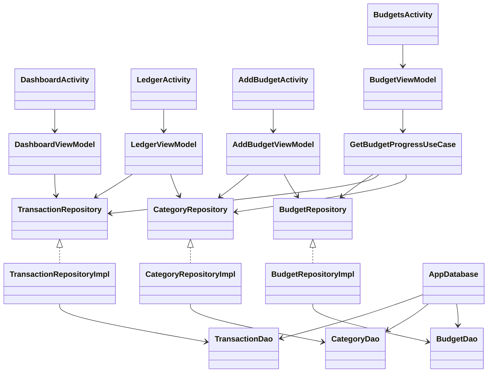
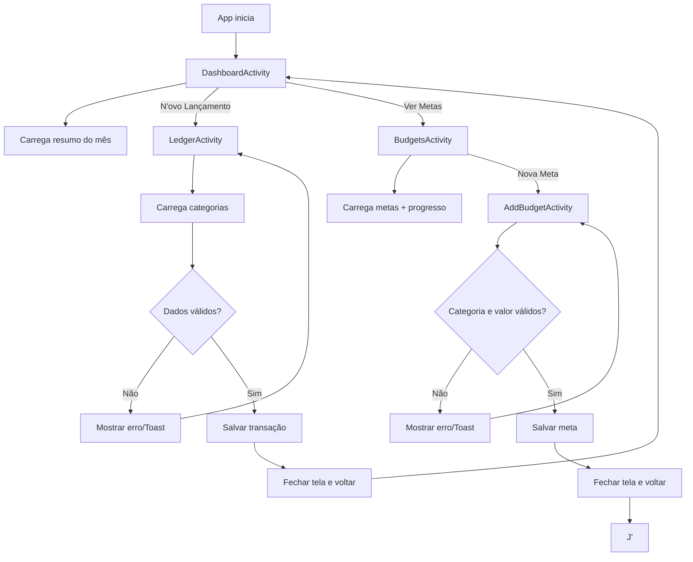

# Documentação de Onboarding — Gestão Financeira Android App

---

## 1) Visão geral do projeto

Este app é um **controle financeiro pessoal** com foco em três fluxos principais:

1. **Dashboard**: mostra saldo, receitas e despesas do mês.
2. **Lançamentos (Ledger)**: permite cadastrar receita/despesa.
3. **Metas de gastos (Budgets)**: lista metas por categoria e permite criar novas metas.

A Activity inicial (launcher) é a `DashboardActivity`, e a navegação parte dela para as demais telas. O mapeamento está no `AndroidManifest.xml`.

---

## 2) Stack e fundamentos Android aplicados

### Tecnologias utilizadas

- **Java 17** + **Android SDK 36**.
- **MVVM** (Activity + ViewModel + LiveData).
- **Room (SQLite)** para persistência local.
- **ViewBinding** para manipular views sem `findViewById`.
- **Material Design 3** para componentes visuais.

### Conceitos Android usados no projeto

- **Activity**: representa uma tela.
- **onCreate()**: ponto de inicialização da tela.
- **onResume()**: usado para recarregar dados quando a tela volta ao foco.
- **ViewModel**: guarda estado e regra de apresentação fora da Activity.
- **LiveData**: canal observável para a UI reagir a mudanças.
- **ExecutorService**: executa operações de banco fora da main thread para evitar travamentos.
- **Room Database**: abstrai SQL com entidades, DAOs e banco versionado.

---

## 3) Arquitetura usada (camadas)

O projeto segue uma divisão de responsabilidades em camadas:

- **presentation/**: Activities, adapters e ViewModels (UI + estado da UI).
- **domain/**: modelos de negócio, interfaces de repositório e use cases.
- **data/**: implementação real de acesso a dados (Room + mappers + repos concretos).

### Fluxo padrão de dados

1. Usuário interage na **Activity**.
2. Activity chama método do **ViewModel**.
3. ViewModel usa **Repository** (interface do domain).
4. Implementação do repository (camada data) conversa com **DAO (Room)**.
5. Resultado volta para ViewModel.
6. ViewModel publica estado em **LiveData**.
7. Activity observa e atualiza a UI.

---

## 4) Estrutura de pastas (prática)

```text
app/src/main/java/com/example/gestaofinanceiraapp/
├── data/
│   ├── local/room/
│   │   ├── dao/
│   │   ├── entity/
│   │   ├── AppDatabase.java
│   │   └── Converters.java
│   ├── mapper/
│   └── repository/
├── domain/
│   ├── model/
│   ├── repository/
│   └── usecase/
└── presentation/
    ├── dashboard/
    ├── ledger/
    └── budget/
```

Também existem os XMLs de layout em:

```text
app/src/main/res/layout/
```

Principais telas:

- `activity_dashboard.xml`
- `activity_ledger.xml`
- `activity_budgets.xml`
- `activity_add_budget.xml`

---

## 5) Fluxo entre arquivos (por funcionalidade)

## 5.1 Dashboard (resumo mensal)

- **Entrada:** `DashboardActivity`.
- Ao abrir/reabrir, chama `viewModel.loadDashboardData()`.
- `DashboardViewModel` busca transações do mês via `TransactionRepository`.
- Soma receitas e despesas, calcula saldo, e publica `DashboardState` no LiveData.
- A Activity observa e atualiza os textos com moeda BRL.

**Arquivos-chave:**
- `presentation/dashboard/DashboardActivity.java`
- `presentation/dashboard/DashboardViewModel.java`
- `presentation/dashboard/DashboardState.java`
- `data/repository/TransactionRepositoryImpl.java`

## 5.2 Novo lançamento (Ledger)

- **Entrada:** botão “Novo Lançamento” na Dashboard abre `LedgerActivity`.
- Activity pede categorias (`viewModel.loadCategories()`), popula dropdown.
- Usuário informa valor, tipo (receita/despesa), categoria, descrição.
- `LedgerViewModel.saveTransaction(...)` monta `Transaction` com UUID + data atual.
- Salva via `TransactionRepositoryImpl` e sinaliza sucesso (`_isSaved=true`).
- Activity recebe sucesso e fecha tela (`finish()`).

**Arquivos-chave:**
- `presentation/ledger/LedgerActivity.java`
- `presentation/ledger/LedgerViewModel.java`
- `data/repository/TransactionRepositoryImpl.java`
- `data/repository/CategoryRepositoryImpl.java`

## 5.3 Metas de orçamento (Budgets)

- **Entrada:** botão “Ver Metas” na Dashboard abre `BudgetsActivity`.
- No `onResume`, a tela chama `loadBudgetsForCurrentMonth()`.
- `BudgetViewModel` usa `GetBudgetProgressUseCase`.
- O use case cruza:
    - metas do mês,
    - transações do mês,
    - dados de categoria.
- Resultado é uma lista de `BudgetProgress` para o adapter desenhar.
- `AddBudgetActivity` cria nova meta e salva no banco.

**Arquivos-chave:**
- `presentation/budget/BudgetsActivity.java`
- `presentation/budget/BudgetViewModel.java`
- `presentation/budget/AddBudgetActivity.java`
- `domain/usecase/GetBudgetProgressUseCase.java`

---

## 6) Banco de dados local (Room)

A classe `AppDatabase` centraliza o Room e expõe três DAOs:

- `transactionDao()`
- `categoryDao()`
- `budgetDao()`

### Entidades principais

- `TransactionEntity`
- `CategoryEntity`
- `BudgetEntity`

### Observações importantes

- O banco está na **versão 5**.
- Está configurado com `fallbackToDestructiveMigration()` (se schema mudar sem migração, recria banco).
- Possui **seed inicial** de categorias no callback de criação do banco.

---

## 7) UML (arquitetura simplificada)

> Diagrama em Mermaid (GitHub/GitLab costumam renderizar automaticamente).



---

## 8) Fluxograma da aplicação (navegação + decisões)



---

## 9) Como rodar e validar localmente

### Pré-requisitos

- Android Studio atualizado.
- JDK 17.
- SDK Android com API 36.

### Passos

1. Abrir projeto no Android Studio.
2. Sincronizar Gradle.
3. Rodar em emulador/dispositivo.

### Comandos úteis (terminal)

```bash
./gradlew assembleDebug
./gradlew test
./gradlew connectedAndroidTest
```

> `connectedAndroidTest` exige emulador/dispositivo conectado.

---

## 10) Guia didático para os novos devs (primeiros estudos)

Sugestão de ordem para entender o projeto:

1. **AndroidManifest** (quais telas existem e qual é a inicial).
2. **DashboardActivity** + **DashboardViewModel** (entender padrão Activity + ViewModel + LiveData).
3. **LedgerActivity** (formulário + validações + persistência).
4. **BudgetsActivity** + **BudgetViewModel** + **GetBudgetProgressUseCase** (exemplo de regra de negócio mais rica).
5. **AppDatabase + DAOs + Entities** (persistência local).
6. **Repositories e Mappers** (fronteira entre domain e data).

---

## 11) Convenções práticas para trabalho em equipe

- Sempre que possível, **não colocar regra de negócio na Activity**.
- Toda operação de I/O deve ficar fora da main thread.
- Preferir adicionar regra nova em **UseCase** quando envolver combinação de dados.
- Manter a separação:
    - `domain` não depende de Android framework.
    - `presentation` não acessa DAO diretamente.
- Em mudanças de banco, versionar schema e planejar migração.

---


